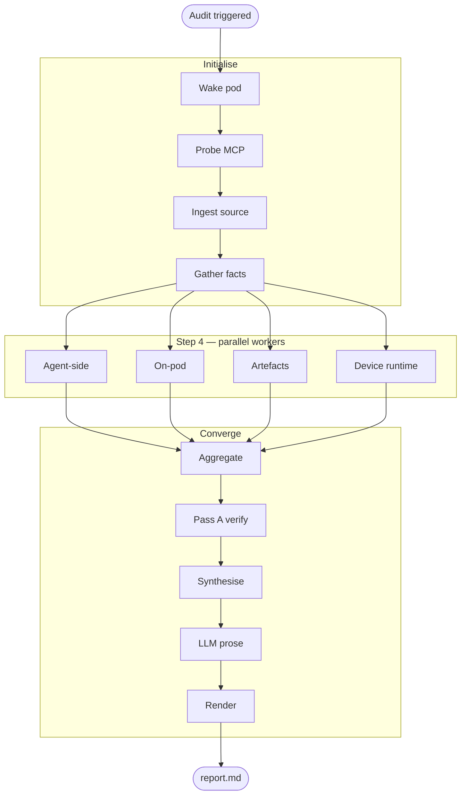

# mobile-perf-audit

Performance audit pipeline for Expo (React Native) applications. Combines static code analysis, bundle composition, dependency hygiene, component-level render perf, pre-publish readiness (App Store + Play Store), backend / database / algorithm rules, and on-device measurement on Android and iOS into a single severity-ranked report.

The pipeline runs against a hosted application environment over an MCP gateway. Reports cover both code-side signals (cheap to compute, complete) and runtime signals (measured on a real or emulated device under a representative user journey).

---

## What it produces

For each audit:

- A Markdown report grouped by severity (Critical / High / Low), with per-category scores, a per-metric device-runtime breakdown, dependency hygiene, bundle composition, and a pre-publish readiness verdict per store.
- A structured JSON deliverable (`report.json`) for programmatic consumption.
- A complete evidence ledger (`evidence.json`, `audit_facts.json`, `decisions.log`) backing every claim in the report.

Findings carry deterministic counts derived from the verdict ledger — no narrated numbers, no inferences from naming conventions.

---

## Workflow at a glance



| Tier | What runs there |
|---|---|
| **Agent-side** | `static_scan.py`, `config_scan.py`, `store_readiness_scan.py`, `backend_scan.py` |
| **On-pod** (via MCP) | `bundle_scan.py` (via `expo export` + `source-map-explorer`); `depcheck` / `madge` / `npm-check-updates`; `run_reassure.sh` |
| **Artefact scans** | `apk_scan.py`, `ipa_scan.py` (operator-supplied APK / IPA) |
| **Device runtime** | Android local emulator + Flashlight CLI (default); Flashlight Cloud (alternate); iOS Simulator + `xcrun simctl` on macOS |

The full diagram (with per-script labels), the data-flow / dual-verdict diagram, and the Maestro flow-generation lifecycle (extract → draft → LLM refine → validate → execute) are in `architecture.md` §2.

---

## Layers covered

| Layer | Worker | What it surfaces |
|---|---|---|
| Static AST (frontend) | `static_scan.py` | tree-sitter rules: unbounded `ScrollView` + `.map()`, uncached `<Image>`, missing `useEffect` cleanup, JS-thread `Animated`, inline JSX props, missing memoization, console.log in production, etc. |
| ESLint (frontend) | via `static_scan.py` | `react-hooks/*`, `react-perf/*`, `react-native/*`, `react/jsx-key` |
| Config | `config_scan.py` | Hermes enabled / New Architecture enabled (Fabric + TurboModules) |
| Codebase facts | `gather_facts.py` | Project signature + deterministic source-pattern counts; source of truth for negative claims |
| Bundle composition | `bundle_scan.py` | `expo export` + per-dependency byte attribution via source-maps + asset audit |
| APK scan | `apk_scan.py` | Shipped bundle size + install footprint + native lib breakdown from a built APK |
| IPA scan | `ipa_scan.py` | Shipped iOS bundle + Info.plist + native frameworks + architecture coverage + PrivacyInfo.xcprivacy presence |
| Dependency hygiene | via on-pod `depcheck` / `madge` / `npm-check-updates` | Unused / circular / outdated deps |
| Component render perf | `gen_reassure_tests.py` + `run_reassure.sh` | Per-screen render counts and durations (Reassure under jest-expo) |
| Pre-publish readiness | `store_readiness_scan.py` | 26 rules across Apple App Store, Google Play, and cross-cutting categories — bundle id placeholder, missing privacy manifest, NSUsageDescription cross-check, Universal Links, App Tracking Transparency, IAP billing, adaptive icons, etc. |
| Backend / DB / algorithm | `backend_scan.py` | 12 ported checks: sync route handlers, N+1 queries, unbounded queries, Mongo client singleton, missing indexes, sequential awaits, blocking I/O in handlers, no-projection queries, complex Pydantic models, nested iteration, array lookup in loop, sequential fetch chains |
| Android runtime | `run_android_perf.sh` (local emulator + Flashlight) / `run_flashlight_cloud.sh` | FPS / cold start / memory / CPU saturation / jank ratio under a Maestro user journey |
| iOS runtime | `run_ios_perf.sh` (`xcrun simctl` + Maestro) | Cold start + memory peak + memory growth per iteration. FPS omitted by design — Mac GPU is not iPhone-comparable even on Apple Silicon. Per-metric reliability tags label each row. |

---

## Repository layout

```
mobile-perf-audit/
├── README.md                       # This file
├── SKILL.md                        # Orchestration spec (load order, step sequence, mandates)
├── RUNBOOK.md                      # Operator guide (environment setup, end-to-end invocation)
├── architecture.md                 # Design rationale, module map, data contracts
├── TESTING.md                      # Regression-test instructions for pipeline development
├── references.md                   # Per-rule reference: detection, verification, FP shapes, framing
│
├── references/
│   └── ranking_heuristics.md       # Severity × confidence × coverage weights used by synthesise
│
├── prompts/
│   ├── synthesize.md               # LLM prompt — slot-fill prose only
│   ├── refine_flow.md              # LLM prompt — Maestro flow refinement
│   └── repair_flow.md              # LLM prompt — Maestro flow repair on validation failure
│
├── schemas/
│   ├── finding.schema.json         # Per-finding contract
│   ├── evidence.schema.json        # Pass A output contract
│   ├── facts.schema.json           # Pinned facts contract
│   ├── perf_result.schema.json     # Device-runtime output contract
│   ├── screen_map.schema.json      # Screen inventory contract (Stage 4d)
│   └── flow_intent.schema.json     # Structured Maestro flow intent (LLM-fillable)
│
├── configs/
│   ├── ast_rules.py                # Frontend tree-sitter AST rules
│   ├── backend_rules.py            # FastAPI Python rules (regex + ast)
│   ├── store_rules.py              # Apple + Google + cross-cutting publishing rules
│   ├── sdk_disclosure_matrix.py    # Per-SDK Apple Nutrition Label + Play Data Safety table
│   ├── eslint.perf.config.js       # ESLint perf ruleset
│   ├── reassure-test-template.tsx  # Template the Reassure stage instantiates per screen
│   └── android-emulator.json       # AVD spec for the local-runner Android emulator
│
├── scripts/                        # One file per pipeline stage (Python or bash)
├── test-fixture/                   # Fixed-input Expo + backend fixture for regression tests
│
├── .mcp.json                       # MCP gateway configuration
├── requirements.txt                # Python dependencies
├── package.json                    # Node dependencies (ESLint, madge, depcheck, etc.)
└── package-lock.json               # Pinned Node dep tree for reproducible installs
```

---

## Quick start

Detailed setup is in `RUNBOOK.md`. The minimal invocation against a pod is:

```bash
export MOBILE_AUDIT_RUNS_DIR="$PWD/.audit-runs"
export EMERGENT_AUTH_TOKEN="<platform-token>"

# 0. Wake the target pod
python3 scripts/wake_pod.py <job_id>

# 1-3. Initialise, ingest source, bootstrap workspace + facts
bash   scripts/init_audit.sh             <audit_id>
python3 scripts/ingest_pod.py            <audit_id> --slug <slug>
bash   scripts/bootstrap_workspace.sh    <audit_id>
python3 scripts/gather_facts.py          <audit_id>

# 4. Workers (run in parallel)
python3 scripts/static_scan.py           <audit_id> &
python3 scripts/config_scan.py           <audit_id> &
python3 scripts/bundle_scan.py           <audit_id> &
python3 scripts/store_readiness_scan.py  <audit_id> &
python3 scripts/backend_scan.py          <audit_id> &
bash   scripts/run_reassure.sh           <audit_id> &
bash   scripts/device_perf.sh            <audit_id> --apk <path.apk> --ipa <path.ipa> --runner local --platform all --consent &
wait

# 5-7. Aggregate, verify, synthesise, render
python3 scripts/aggregate_findings.py    <audit_id>
python3 scripts/pass_a_verify.py         <audit_id>
python3 scripts/synthesize.py            <audit_id>
python3 scripts/render_report.py         <audit_id>
```

The complete deliverable is written to `.audit-runs/<audit_id>/report/report.md` and additionally echoed to stdout between delimiter fences (the guaranteed delivery channel for hosted execution environments).

---

## Design principles

The pipeline encodes a small number of architectural decisions; see `architecture.md` §6 for the full set:

- **Evidence before prose.** No stage that writes report text runs before Pass A has stamped a verdict on every finding.
- **Counts are derived, not narrated.** Every count in the report equals `len(findings where verdict=='REAL')`; no LLM-computed numbers.
- **Negative claims require facts.** Any "X is not used" claim cites a field in `audit_facts.json` whose value confirms absence.
- **AST detection, not regex** (frontend). Tree-sitter parse trees rule out a class of false positives that line-level regex inherits.
- **Per-stage failure isolation.** A failing worker emits a single tooling finding and exits clean; other workers proceed.
- **Honest reliability labels.** Device metrics carry per-metric reliability tags; iOS Simulator measurements explicitly distinguish "reliable", "device-class estimate", and "regression-relative only" per host architecture.

---

