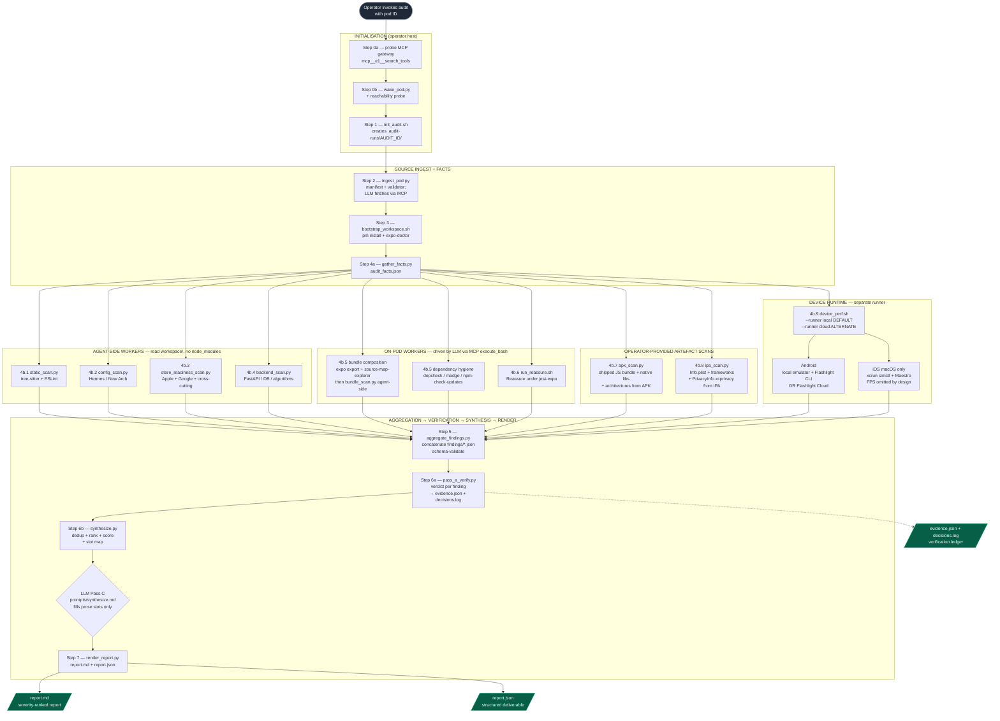
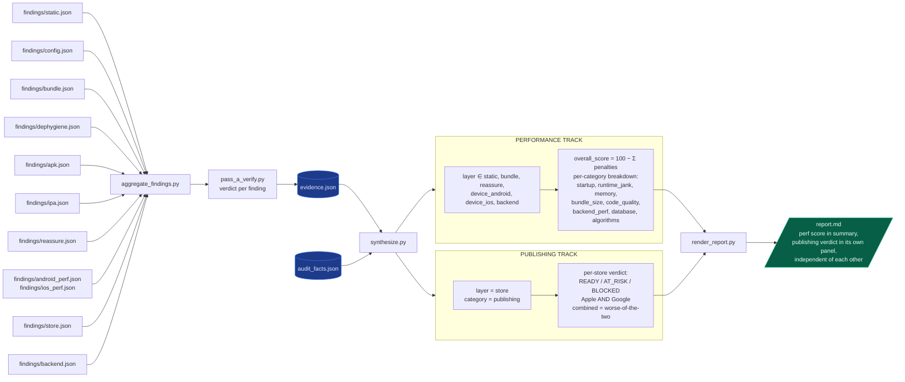

# Architecture

This document describes the design of the mobile-perf-audit pipeline: what each module does, how data flows between them, and the contracts that hold the system together. Operational instructions (how to run an audit, environment setup) live in `RUNBOOK.md`. Orchestration steps live in `SKILL.md`. Per-rule semantics live in `references.md`.

---

## 1. Scope

The pipeline audits Expo / React Native applications and produces a per-metric perf report covering Android and iOS. It combines two evidence layers:

- **Static signals** — patterns in source code, dependencies, configuration, and shipped binaries that predict perf problems. Cheap to compute and complete in seconds.
- **Runtime signals** — frame rate, cold start, memory growth, CPU saturation measured on a real or emulated device under a representative user journey.

A synthesis stage cross-references the two so each rendered finding carries both a measured symptom and (where derivable) a candidate cause.

Outputs:
- A Markdown report (`report.md`) with severity-grouped findings, per-category scores, per-platform device metrics, and remediation guidance.
- A structured JSON deliverable (`report.json`) suitable for programmatic consumption.
- A complete evidence ledger (`evidence.json`, `audit_facts.json`, `decisions.log`) supporting every claim in the report.

---

## 2. Execution model

The pipeline executes on an operator host (laptop, CI worker, or platform agent). The host fetches source from a target environment over an MCP gateway, materialises it under a per-audit working directory, runs each stage, and renders the report.

Work is split across three execution tiers:

| Tier | Examples | Why |
|---|---|---|
| **Agent-side** (operator host) | static AST scan, config scan, fact gathering, store-readiness scan, backend scan, aggregation, synthesis, render | No `node_modules` required; fast; runs anywhere |
| **On-pod** (target environment, via MCP) | Expo bundle export, source-map-explorer attribution, dependency hygiene tooling (`depcheck` / `madge` / `npm-check-updates`), optional Reassure | Needs the project's installed `node_modules` |
| **Separate runner** (operator host or cloud) | APK / IPA scan, Android device runtime (Flashlight + Maestro), iOS Simulator runtime (`xcrun simctl` + Maestro) | Needs device tooling; not available in containerised pods |

State lives on the filesystem under `.audit-runs/{audit_id}/`. There is no service component, database, or queue. Each audit is a standalone tree the operator can archive or discard.

### End-to-end workflow

The full pipeline runs as a linear backbone of initialisation steps, a fan-out into parallel workers grouped by execution tier, and a fan-in into aggregation → verification → synthesis → render. Solid arrows show the control flow; dashed arrows show data dependencies.



### Data-flow + dual-verdict model

Findings flow through a single ledger (`evidence.json`) but produce **two independent verdicts** at the synthesis stage. The performance score and the publishing readiness verdict are computed from disjoint subsets of the ledger and surface in separate panels of the report.



The architectural reasoning: a fast app can still be unshippable (placeholder bundle ID, missing privacy manifest); a shippable app can still be slow. Conflating the two verdicts into one score has historically led to one masking the other. Keeping them disjoint forces the report to answer both questions independently.

---

## 3. Directory layout

```
mobile-perf-audit/
├── SKILL.md                         # Orchestration spec (load order, step sequence, mandates)
├── RUNBOOK.md                       # Operator guide (environment setup, end-to-end invocation)
├── architecture.md                  # This document
├── references.md                    # Per-rule reference: detection, verification, FP shapes, report framing
├── TESTING.md                       # Regression-test instructions for pipeline development
├── references/
│   └── ranking_heuristics.md        # Severity × confidence × coverage weights used by synthesise
├── prompts/                         # LLM prompts (one per stage that uses an LLM)
│   ├── synthesize.md                # Report-template-fill prompt
│   ├── refine_flow.md               # Maestro flow refinement prompt
│   └── repair_flow.md               # Maestro flow repair prompt
├── schemas/                         # JSON schemas — the inter-stage contracts
│   ├── finding.schema.json
│   ├── evidence.schema.json
│   ├── facts.schema.json
│   ├── screen_map.schema.json
│   ├── flow_intent.schema.json
│   └── perf_result.schema.json
├── configs/
│   ├── ast_rules.py                 # Tree-sitter AST rules (frontend)
│   ├── backend_rules.py             # Regex + Python AST rules (FastAPI)
│   ├── store_rules.py               # App Store / Play Store readiness rules
│   ├── sdk_disclosure_matrix.py     # Per-SDK Apple Nutrition Label + Play Data Safety table
│   ├── eslint.perf.config.js        # ESLint perf ruleset
│   ├── reassure-test-template.tsx   # Template the Reassure stage instantiates per screen
│   └── android-emulator.json        # AVD spec for the local-runner Android emulator
├── scripts/                         # One file per stage (Python or bash)
└── test-fixture/                    # Fixed-input Expo project for regression testing
```

A per-audit run materialises:

```
.audit-runs/{audit_id}/
├── audit.json              # Run metadata: id, target, started_at, config
├── workspace/              # Ingested source (frontend + optionally backend)
├── facts/audit_facts.json  # Deterministic counts / project signature
├── findings/               # One file per worker: static.json, bundle.json, …
├── artifacts/              # APK / IPA / source-map exports / sme.json
├── flows/                  # Generated Maestro flows + screen maps
├── results/                # Device perf_result.json (per platform) + Lighthouse breakdown
├── evidence/evidence.json  # Per-finding verdicts + cross-references (Pass A output)
├── decisions.log           # One line per finding: rule_id, file:line, verdict, reason
└── report/
    ├── report.json         # Structured deliverable
    └── report.md           # Rendered Markdown report
```

---

## 4. Pipeline stages

Each stage has a single responsibility, a typed input, and a typed output. Stages 4a–4f run independently of each other; everything else is sequential.

| Stage | Component | Reads | Writes |
|---|---|---|---|
| 1 | `init_audit.sh` | Operator input | `.audit-runs/{id}/audit.json` |
| 2 | `ingest_pod.py` | MCP gateway → target source tree | `workspace/` |
| 3 | `bootstrap_workspace.sh` + `gather_facts.py` | `workspace/` | `facts/audit_facts.json`, `audit_meta.json` |
| 4a | `static_scan.py` (+ ESLint) | `workspace/` | `findings/static.json` |
| 4b | `config_scan.py` | `facts/audit_facts.json` | `findings/config.json` |
| 4c | `bundle_scan.py` (+ on-pod `expo export`, `source-map-explorer`) | `workspace/`, on-pod artefacts | `findings/bundle.json`, `findings/dephygiene.json` |
| 4c′ | `apk_scan.py` / `ipa_scan.py` | Operator-provided APK / IPA | `findings/apk.json`, `findings/ipa.json`, `artifacts/{apk,ipa}_scan.json` |
| 4d | `gen_reassure_tests.py` + `run_reassure.sh` + `transform_reassure.py` | `workspace/`, on-pod jest-expo | `findings/reassure.json` |
| 4e | `store_readiness_scan.py` | `workspace/app.json`, `package.json`, source | `findings/store.json` |
| 4f | `backend_scan.py` | `workspace/backend/` (if present) | `findings/backend.json` |
| 5a | `device_perf.sh` → `run_android_perf.sh` + `run_ios_perf.sh` | APK, IPA, Maestro flow | `results/android.json`, `results/ios.json` |
| 5b | `compute_device_metrics.py` | `results/{platform}.json` | `results/device_lighthouse*.json` |
| 5c | `transform_device_metrics.py` | `results/{platform}.json` | `findings/{platform}_perf.json` |
| 6 | `aggregate_findings.py` | All `findings/*.json` | `findings/all_findings.json` |
| 7 | `pass_a_verify.py` | `findings/all_findings.json` | `evidence/evidence.json`, `decisions.log` |
| 8 | `synthesize.py` | `evidence/evidence.json`, `audit_facts.json` | `report/synthesis_input.json`, `report/report.json` |
| 9 | `render_report.py` | `report/report.json` | `report/report.md` |

See `SKILL.md` for the orchestration sequence and `RUNBOOK.md` for the end-to-end invocation.

---

## 5. Data contracts

Every stage produces JSON that conforms to a schema in `schemas/`. New stages must extend an existing schema or add a new one; ad-hoc shapes are rejected by `aggregate_findings.py`.

### 5.1 Finding (`schemas/finding.schema.json`)

Common to every worker output. Required: `id`, `layer`, `category`, `severity`, `title`, `evidence`. Optional: `confidence`, `description`, `suggested_fix`, `related_finding_ids`. Internal-only (stripped before render): `verdict`, `verification_method`.

Layers: `static`, `bundle`, `reassure`, `device_android`, `device_ios`, `tooling`, `store`, `backend`.
Categories: `startup`, `runtime_jank`, `memory`, `bundle_size`, `code_quality`, `config`, `tooling_error`, `publishing`, `backend_perf`, `database`, `algorithms`.

### 5.2 Evidence (`schemas/evidence.schema.json`)

The verdicted output of Pass A. Each rule_id maps to a list of stamped findings plus a summary `{real, fp, uncertain, distinct_files}`. Drives the count-derivation rule in `references.md` §1.2.

### 5.3 Facts (`schemas/facts.schema.json`)

Deterministic counts and project signature gathered up-front. Source of truth for negative claims (per `references.md` §1.3): no claim of absence may be made without citing a fact field whose value confirms it.

Key blocks: `project_signature` (SDK / RN / Hermes / New Architecture / bundle identifiers), `dependencies` (counts + capability flags), `source_pattern_counts` (AST-derived occurrence counts), `assets` (image inventory), `presence` (directory existence flags), `tooling_status` (`depcheck` / `madge` / `npm-check-updates` results), `backend` (Stage 4f counts).

### 5.4 Perf result (`schemas/perf_result.schema.json`)

Device-runtime output. Per-platform; each iteration carries FPS averages, CPU per thread, memory averages / peak / growth, and optional blocking intervals. iOS results additionally carry a `measurement_environment` block describing host architecture.

### 5.5 Screen map + flow intent (`schemas/screen_map.schema.json`, `schemas/flow_intent.schema.json`)

`extract_screen_map.py` walks `workspace/app/**` and produces a deterministic inventory of screens, navigation patterns, and interactive elements. `refine_flow_with_llm.py` fills `flow_intent.schema.json` (login steps, per-tab interactions, scroll targets); `render_flow_yaml.py` deterministically renders Maestro YAML from the intent. The LLM never writes YAML directly.

---

## 5.6 Pre-publish readiness model (Stage 4e)

Pre-publish readiness is a parallel verdict track to the perf score. Findings carry `layer = "store"` and `category = "publishing"`; they do **not** contribute to the 0–100 perf score, by design — performance and shippability are independent questions and each gets its own answer in the report.

### Rule families

`configs/store_rules.py` registers 26 rules across four namespaces:

| Namespace | Concern | Detection input |
|---|---|---|
| `store.ios.*` | Apple App Store — bundle identifier shape, `NSUsageDescription` cross-check against permission APIs used in source, `PrivacyInfo.xcprivacy` per detected SDK, App Tracking Transparency, Universal Links (`associatedDomains`), App Transport Security, encryption export, deployment target, background modes justification, IAP setup reminder | `app.json` / `app.config.*`, `package.json`, source index for `NS*UsageDescription`-triggering API call patterns |
| `store.android.*` | Google Play — package name shape, `targetSdkVersion` floor, declared-but-unused vs. used-but-undeclared permission cross-check, `POST_NOTIFICATIONS` (Android 13+), `BILLING` permission for IAP libraries, adaptive icon, cleartext traffic, App Links `autoVerify`, foreground service type (Android 14+), `versionCode` | Same inputs as `store.ios.*` |
| `store.cross.*` | Both stores — app icon, display name, version, hardcoded dev URLs in shipped source, unguarded test-mode API keys | `app.json`, source index |
| `store.process.*` | Auto-assessed process items — privacy policy URL declaration, `google-services.json` / `GoogleService-Info.plist` presence (cross-checked against `expo.{android,ios}.googleServicesFile` references), push wiring detection, IAP SKU enumeration (parses source for SKU literals), per-SDK Privacy Nutrition Label + Play Data Safety category requirements (driven by `configs/sdk_disclosure_matrix.py`) | `app.json`, `package.json`, source index for IAP API call sites |

### SDK disclosure matrix

`configs/sdk_disclosure_matrix.py` maps each known SDK to its required disclosures. Each row carries:
- A regex matching the package name (e.g. `^@react-native-firebase/analytics$|^firebase$`).
- Whether a `PrivacyInfo.xcprivacy` entry is required.
- Whether App Tracking Transparency applies (`NSUserTrackingUsageDescription` required).
- The exact Apple Privacy Nutrition Label categories to declare (e.g. `"Usage Data → Product Interaction"`, `"Identifiers → User ID"`).
- The exact Play Data Safety categories to declare.

Seeded with ~16 SDKs (Firebase Analytics / Crashlytics / Messaging / Core, Sentry, Bugsnag, PostHog, Amplitude, Mixpanel, Branch, Adjust, AppsFlyer, RevenueCat, OneSignal, Expo Notifications, Expo Auth Session, `react-native-iap`). Extended as new SDKs are encountered.

### Verdict computation

`synthesize.py` reads `evidence.json` for `layer == "store"` findings, partitions by namespace, and computes a per-platform verdict:

```
READY    : 0 CRITICAL + 0 HIGH publishing findings for the platform
AT_RISK  : 0 CRITICAL + ≥1 HIGH
BLOCKED  : ≥1 CRITICAL
```

Cross-cutting findings count against **both** platforms. The combined verdict is the worse of Apple and Google. The result lands in `report.json` as `publishing_verdict = { apple, google, combined, counts }`.

### Render shape

The report's "Pre-publish readiness" section renders:

1. The verdict banner per platform plus the combined verdict.
2. A code/config blocker table per store, severity-sorted.
3. An "Auto-assessed process items" block with per-item status (PASS / FAIL / UNVERIFIED / ENUMERATED).
4. The extracted IAP SKU list, when `react-native-iap` or `expo-in-app-purchases` is present in the dependency tree.
5. A "Privacy disclosures required" block — one entry per detected SDK, listing the Apple Nutrition Label categories and Play Data Safety categories to declare verbatim.
6. A "Manual process items" checklist for items that genuinely require console / human action (screenshots, listing copy, TestFlight beta, content rating, IAP product creation, privacy policy text review).

### Phase A vs Phase B checks

The current implementation is **Phase A only** — config reads, file-existence checks, and source-pattern matching. **Phase B** (HTTP-based verification of the declared privacy policy URL, `apple-app-site-association` fetch + JSON validation against the bundle id, `assetlinks.json` fetch + package + SHA256 fingerprint validation) is scoped but not yet implemented; the rule IDs are in place and the rules emit "UNVERIFIED" for items that would require an outbound HTTP fetch.

---

## 5.7 Backend perf model (Stage 4f)

`configs/backend_rules.py` ports twelve checks from the web `perf-audit` pipeline (`c:/Users/adity/Desktop/audit/perf-audit/perf_audit.py`) and adapts them to the mobile pipeline's Finding shape:

| Rule | Layer | Category | Detection |
|---|---|---|---|
| `backend.sync_route_handler` | backend | backend_perf | Python AST — `ast.FunctionDef` nodes (not async) with a FastAPI route decorator |
| `backend.n_plus_one_query` | backend | backend_perf | Line scan tracking `for` / `while` / `async for` indent depth; flags `.find` / `.find_one` / `.aggregate` / `.count_documents` / `.distinct` calls inside |
| `backend.unbounded_query` | backend | backend_perf | Regex pair: `.find(` without a `.limit(N)` / `.to_list(N)` / `limit=` marker within the next 3 lines |
| `backend.mongo_client_not_singleton` | backend | database | Python AST — `MongoClient(...)` / `AsyncIOMotorClient(...)` instantiation inside a route handler body |
| `database.missing_index` | backend | database | Per-file: collect field names appearing in `.find({...})` filters vs. field names passed to `create_index('...')`. Flag the difference |
| `backend.sequential_await_chain` | backend | backend_perf | Line scan — ≥ 3 consecutive `await ` lines with distinct assigned variables |
| `backend.blocking_work_in_handler` | backend | backend_perf | Python AST — route handler with body matching email / push / webhook / payment / analytics regex AND no `BackgroundTasks` reference |
| `backend.no_projection_on_query` | backend | backend_perf | Regex — `.find(filter)` with no projection argument; capped at 10 findings per audit |
| `backend.pydantic_complex_model` | backend | backend_perf | Python AST — `BaseModel` subclasses with ≥ 3 `List` / `Optional` annotated fields |
| `algorithms.nested_iteration` | backend | algorithms | Regex — `.filter(...).filter(`, `.find(...).find(`, `.some(...).some(`, `.includes(...).includes(`, `for ... for ... .includes(` |
| `algorithms.linear_array_lookup_in_loop` | backend | algorithms | Line scan — `.includes(` / `.indexOf(` / `.find(` inside a `for` / `.forEach` / `.map` / `.filter` line opener; capped at 10 |
| `backend.sequential_fetch_chain` | backend | backend_perf | Line scan — ≥ 2 consecutive `await fetch(...)` / `await axios.X(...)` calls |

Findings from this stage contribute to the perf score via three categories — `backend_perf`, `database`, `algorithms`. Combined weight ~0.30 in `CATEGORY_SCORE_WEIGHTS`. The stage runs only if `workspace/backend/` (or `workspace/server/`, `workspace/api/`) was ingested; absence produces a single `tooling.backend_source_missing` finding.

---

## 6. Design principles

These are the architectural decisions that hold across the pipeline. Each was made to address a specific failure mode observed in earlier perf-audit work.

### 6.1 AST detection, not regex (frontend)

Frontend perf rules use `tree-sitter-typescript` queries over a real parse tree. This rules out a class of false positives that regex-based detectors inherit (matches inside comments, matches across statement boundaries, receiver-type confusion). Backend rules use Python's `ast` module for the same reason; for line-level patterns (sequential awaits, consecutive fetches) regex is acceptable.

### 6.2 Evidence-before-prose

No stage that produces report prose may run before Pass A has stamped a verdict on every finding. The synthesis stage reads `evidence.json` only; it never invents counts or summary claims. This is enforced structurally by the order in `SKILL.md`.

### 6.3 Counts derived, not narrated

Every count in the report (`"5 HIGH findings"`, `"33 sites across 23 files"`) is derived from `len(findings where verdict=='REAL')`. No prose stage is allowed to compute its own counts. See `references.md` §1.2.

### 6.4 Negative claims require facts

Any claim of absence in the report (`"react-native-reanimated is not used"`, `"no FlatList instances"`) cites a field in `audit_facts.json` whose value confirms the absence. Claims without grounding facts are rejected by `references.md` §1.3.

### 6.5 Pass A / Pass C separation

The synthesis stage is split deterministically:

- **Pass A** (`pass_a_verify.py`) — per-rule verification logic stamps each finding with `verdict ∈ {REAL, FP, UNCERTAIN}` and a one-line reason. Deterministic; reads source.
- **Pass C** (an LLM via `prompts/synthesize.md`) — fills slots in the report template with prose (impact paragraphs, fix-diff text). Cannot change counts, verdicts, or the slot structure.

This avoids the failure mode where a single mega-prompt does dedup + rank + scoring + prose in one pass and silently fabricates numbers.

### 6.6 Report-is-the-deliverable

Internal scaffolding never surfaces in `report.md`:

- No FP / UNCERTAIN counts
- No `verdict` labels (REAL / FP / UNCERTAIN)
- No JSON-path citations (`evidence.json:summary.x.real`)
- No mentions of pipeline stage names ("Pass A", "Stage 4f")
- No links to evidence files

The customer reads a clean report; the operator inspects the evidence ledger separately. Enforced by `references.md` §1.8 and §7 (forbidden patterns).

### 6.7 Per-stage failure isolation

A failure in one worker never aborts another. Bundle export fails → a `tooling.bundle_export_failed` finding is emitted and the rest of the pipeline proceeds. Reassure can't bootstrap → `tooling.reassure_unavailable` finding, no abort. The coverage table in the rendered report states which stages actually ran.

### 6.8 Honest reliability labels (device runtime)

Device metrics carry per-metric reliability tags. iOS Simulator measurements label cold start and peak memory as "device-class estimate" on Apple Silicon hosts and "regression-relative only" on Intel hosts. FPS is omitted from iOS Simulator runs by design (Mac GPU is not iPhone-comparable regardless of CPU family). Memory growth across iterations is the highest-reliability iOS signal and is labelled accordingly.

### 6.9 Configurable output root

The audit working directory root is controlled by `MOBILE_AUDIT_RUNS_DIR` (default `.audit-runs`). Hosted environments redirect this to platform-managed storage; local runs use the default.

### 6.10 Shell-quoting helper

Python stages that build shell commands use a local `_sh_quote(...)` helper rather than `shlex.quote` / `repr` / f-string interpolation. The helper wraps in single quotes and escapes embedded single quotes only — this is the only POSIX-shell-safe shape for grep patterns that contain backslashes. The legacy alternative silently breaks on `\b` and `\s`.

---

## 7. Extension points

### 7.1 Adding a frontend AST rule

1. Implement `rule_<name>(tree, file_path, source_bytes) -> list[dict]` in `configs/ast_rules.py`.
2. Register in the `RULES` list at the bottom of that file.
3. Add a §3 entry to `references.md` (Source / What the rule matches / Verification protocol additions / Common false-positive shapes / Report framing).
4. Add entries to `DETERMINISTIC_ACTIONABLES`, `DETERMINISTIC_AFTER_FIXING`, `DETERMINISTIC_PLAIN_TERMS` in `scripts/render_report.py`.
5. Add a fixture under `test-fixture/` that the rule fires on (positive) and one it doesn't fire on (negative).

### 7.2 Adding a backend rule

Same as 7.1 but in `configs/backend_rules.py` and registered under `BACKEND_RULES` / `ALGORITHM_RULES` / `ALL_RULES`. Pass A picks up `backend.*` / `database.* `/ `algorithms.*` rule IDs via the `verify_backend_finding` default verifier; no Pass A change required for typical rules.

### 7.3 Adding a store-readiness rule

In `configs/store_rules.py`; register under `APPLE_RULES` / `GOOGLE_RULES` / `CROSS_RULES` / `PROCESS_RULES`. Store findings drive a separate `READY / AT_RISK / BLOCKED` verdict per store and do not contribute to the overall perf score.

### 7.4 Adding a category to the perf score

Extend `CATEGORY_DISPLAY_ORDER` and `CATEGORY_SCORE_WEIGHTS` in `scripts/synthesize.py` AND `category_keys` in `scripts/pass_a_verify.py`. The two lists must stay in sync; adding to one without the other produces a silent zero-row in the report.

### 7.5 Adding a new worker stage

1. Create `scripts/<stage>_scan.py` that reads from `workspace/` and writes `findings/<stage>.json`.
2. `aggregate_findings.py` globs `findings/*.json` — no registration needed.
3. Add a row to `_compute_coverage` in `scripts/synthesize.py`.
4. Extend the `layer` and (if needed) `category` enums in `schemas/finding.schema.json`.

---

## 8. Known limitations

| Limitation | Workaround |
|---|---|
| iOS device-runtime FPS / thermal / energy not measured | Profile on a real iPhone via Xcode Instruments; outside audit scope |
| Reassure stage requires `jest-expo` to bootstrap | When it can't, an explicit tooling finding is emitted; the report renders the rest without component-level perf |
| Bundle scan requires `node_modules` on the source host | Run Stage 4c on the target environment via MCP, not on the operator host |
| Pre-built APK / IPA required for device runtime | EAS cloud build or local Xcode / Gradle export |
| File-local index detection for `database.missing_index` | Centralised `init_indexes.py` patterns produce false positives; cross-reference `facts.backend.indexed_collections` to override |
| Architecture detection in `ipa_scan.py` falls back to magic-byte heuristic when `lipo` is unavailable | Run on macOS for precise architecture enumeration |
